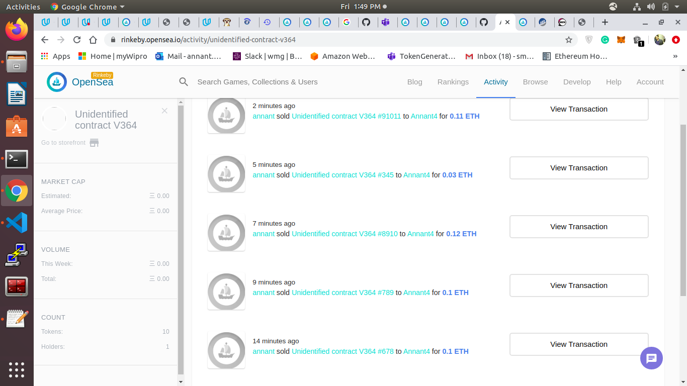
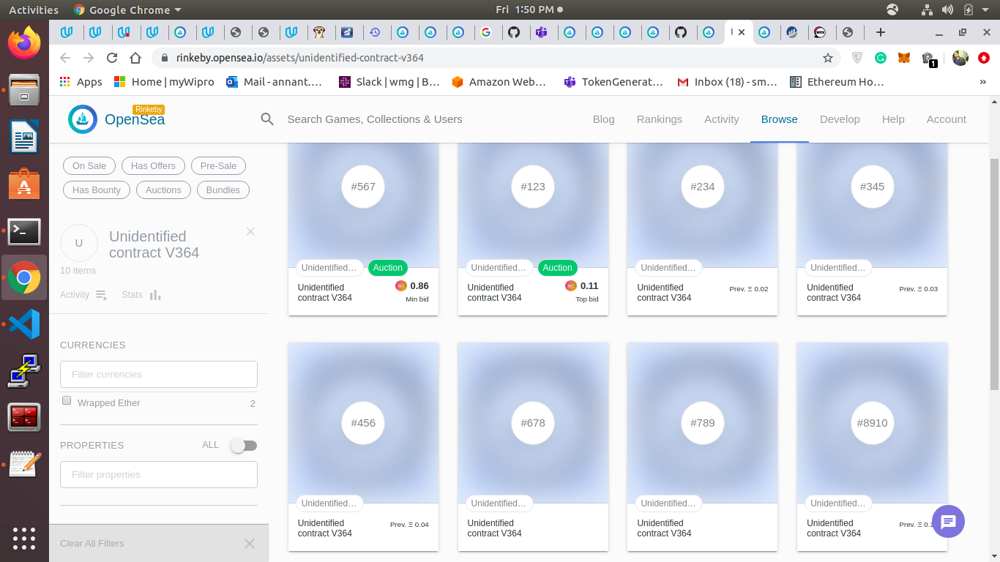

# Udacity Blockchain Capstone

The capstone will build upon the knowledge you have gained in the course in order to build a decentralized housing product. 

## Getting Started

### Prequisites
For development make sure ganache-cli is installed globally,metamask extension is enabled and solidity compiler is configured in truffle config.

### Install Dependencies
* Install all requisite npm packages
```
npm install
```


### ZoKrates Setup

 The following instructions explain how to generate addtional proofs for tokenIds.

* Step 1: Run Docker

* Step 2: Run ZoKrates
  ```
  docker run -v `pwd`/zokrates/code/:/home/zokrates/code -ti zokrates/zokrates /bin/bash
  ```

  Change into the square directory
  ``` 
  cd code/square/
  ``` 

* Step 3: Compile the program written in ZoKrates DSL
  ``` 
  ~/zokrates compile -i square.code
  ``` 

* Step 4: Generate the trusted setup
  ``` 
  ~/zokrates setup -s GM17
  ```

* Step 5: Compute witness
  ``` 
  ~/zokrates compute-witness -a 3 9
  ```

* Step 6: Generate proof
  ```
  ~/zokrates generate-proof -s GM17 -j <path to proof file>
  ```

* Step 7: Export verifier
  ```  
  ~/zokrates export-verifier -s GM17
  ```
Re-run steps 5 and 6 with different arguments, e.g. 2 4, to generate additional proofs for minting tokens.

### Development environment
* Run ganache:
```
ganache-cli
```
* In another terminal window:
```
cd eth-contracts
```
* Compile the contracts:
```
truffle compile
```

* This will create the smart contract artifacts in folder ```build/contracts```.

* Migrate smart contracts to the locally running blockchain, ganache-cli:

```
truffle migrate
```

* Test the smart contracts:

```
truffle test
```

### Deploy on Rinkeby
Run
```
truffle migrate --network rinkeby --reset --compile-all
```


#### Output
```
Starting migrations...
======================
> Network name:    'rinkeby'
> Network id:      4
> Block gas limit: 0x989680


1_initial_migration.js
======================

   Deploying 'Migrations'
   ----------------------
   > transaction hash:    0x09e4f22d2cbeef8aaba5f6f67586e665c267e80983727609f69e8ad51ba23f07
   > Blocks: 1            Seconds: 14
   > contract address:    0x905e6eb3330c1Cdbe5B06bdbff9a9273c24Ad4B0
   > block number:        6488604
   > block timestamp:     1589484500
   > account:             0x7554744F910b0E8925f108a40201eE25B4823ab1
   > balance:             13.239707291
   > gas used:            225237
   > gas price:           10 gwei
   > value sent:          0 ETH
   > total cost:          0.00225237 ETH


   > Saving migration to chain.
   > Saving artifacts
   -------------------------------------
   > Total cost:          0.00225237 ETH


2_deploy_contracts.js
=====================

   Deploying 'RealStateToken'
   --------------------------
   > transaction hash:    0xb51257a18b83bd80e20f2e9cbda4b880c5c321624dddd1b3c7a412b99e2d6384
   > Blocks: 2            Seconds: 21
   > contract address:    0xaA607d11ab0b63821F6C58236ce0e6A5cF1Cd293
   > block number:        6488607
   > block timestamp:     1589484545
   > account:             0x7554744F910b0E8925f108a40201eE25B4823ab1
   > balance:             13.211194571
   > gas used:            2808909
   > gas price:           10 gwei
   > value sent:          0 ETH
   > total cost:          0.02808909 ETH


   Deploying 'BN256G2'
   -------------------
   > transaction hash:    0xd57cc482668124818ec1aa0113f9ee1195a9470623cefccfc7fc832fc3c6b2c6
   > Blocks: 1            Seconds: 17
   > contract address:    0x3210D92954fa89f15fAC51d4faa77f4Bc67b9F9B
   > block number:        6488609
   > block timestamp:     1589484575
   > account:             0x7554744F910b0E8925f108a40201eE25B4823ab1
   > balance:             13.200858831
   > gas used:            1033574
   > gas price:           10 gwei
   > value sent:          0 ETH
   > total cost:          0.01033574 ETH


   Linking
   -------
   * Contract: Verifier <--> Library: BN256G2 (at address: 0x3210D92954fa89f15fAC51d4faa77f4Bc67b9F9B)

   Deploying 'Verifier'
   --------------------
   > transaction hash:    0x79f7c78fbfa3c3c845e57838094df280254a772cb444c105e9efeb0e6c07b981
   > Blocks: 0            Seconds: 6
   > contract address:    0x6bFdAd4f52a379ED677150C0255DC8c7FAC4D23c
   > block number:        6488610
   > block timestamp:     1589484590
   > account:             0x7554744F910b0E8925f108a40201eE25B4823ab1
   > balance:             13.188841361
   > gas used:            1201747
   > gas price:           10 gwei
   > value sent:          0 ETH
   > total cost:          0.01201747 ETH


   Deploying 'SolnSquareVerifier'
   ------------------------------
   > transaction hash:    0xc754812203145782df2af5f17629c09b8e13d0cf2386471d173afc240a47833d
   > Blocks: 1            Seconds: 17
   > contract address:    0x83239b98B5e046eEdA7F28aB68035Ea9F0bfe490
   > block number:        6488612
   > block timestamp:     1589484620
   > account:             0x7554744F910b0E8925f108a40201eE25B4823ab1
   > balance:             13.155314351
   > gas used:            3352701
   > gas price:           10 gwei
   > value sent:          0 ETH
   > total cost:          0.03352701 ETH


   > Saving migration to chain.
   > Saving artifacts
   -------------------------------------
   > Total cost:          0.08396931 ETH


Summary
=======
> Total deployments:   5
> Final cost:          0.08622168 ETH
```

### Mint Tokens
* Inside ```eth-contracts folder```, Run
```
node addSolution.js ../zokrates/code/square/proofs/proof<number>.json <tokenId>
```
	
	
## output for token 123
```
Submitting solution:
- Input: 0x0000000000000000000000000000000000000000000000000000000000000009,0x0000000000000000000000000000000000000000000000000000000000000001
- TokenID: 123
- Address: 0x7554744F910b0E8925f108a40201eE25B4823ab1
{ blockHash: '0xc1659c5b5fd94c27cd964670d546fe412f5043ab6402a4b8ab37941e008850d8',
  blockNumber: 6488620,
  contractAddress: null,
  cumulativeGasUsed: 886976,
  from: '0x7554744f910b0e8925f108a40201ee25b4823ab1',
  gasUsed: 487594,
  logsBloom: '0x00000000000000000000000040000008100000000000000400000000000000000800000000000000000002000000100000000000000100000000000004000000000040000000020000000800000000000000020000000000000000000000008000000000000000000000000000000000000000000000008000000000000000000000000000000000800000000000000000000000000000000000000000000000000000000000000000000000000000000000000000000000000000000000008000000000000000000000000200000000000000000000000000000000000000000000020000000000000000000000000000000000400000000100000000000000',
  status: true,
  to: '0x83239b98b5e046eeda7f28ab68035ea9f0bfe490',
  transactionHash: '0xbb9b28e5ba1e282ab19faf81d85af7484c4af1f6d47b9b032b0bc6a99ab67381',
  transactionIndex: 3,
  events: 
   { '0': 
      { address: '0x6bFdAd4f52a379ED677150C0255DC8c7FAC4D23c',
        blockHash: '0xc1659c5b5fd94c27cd964670d546fe412f5043ab6402a4b8ab37941e008850d8',
        blockNumber: 6488620,
        logIndex: 11,
        removed: false,
        transactionHash: '0xbb9b28e5ba1e282ab19faf81d85af7484c4af1f6d47b9b032b0bc6a99ab67381',
        transactionIndex: 3,
        id: 'log_6976387f',
        returnValues: Result {},
        event: undefined,
        signature: null,
        raw: [Object] },
     solutionAdded: 
      { address: '0x83239b98B5e046eEdA7F28aB68035Ea9F0bfe490',
        blockHash: '0xc1659c5b5fd94c27cd964670d546fe412f5043ab6402a4b8ab37941e008850d8',
        blockNumber: 6488620,
        logIndex: 12,
        removed: false,
        transactionHash: '0xbb9b28e5ba1e282ab19faf81d85af7484c4af1f6d47b9b032b0bc6a99ab67381',
        transactionIndex: 3,
        id: 'log_7d30d82c',
        returnValues: [Object],
        event: 'solutionAdded',
        signature: '0x009c6ded84843084fe9bc0caed609ea68a61107c44ae1f1ae757f07d382edde5',

```

```
node mintToken.js <tokenId>
```

#### Output for tokenid 123
```
Before minting, the contract has 0 token
Minting new token:
- Token ID: 123
- Address 0x7554744F910b0E8925f108a40201eE25B4823ab1
{ blockHash: '0xd192be19f69667d1f8b9b83da3b072f0b8a211089300a6fb960bb37bd425e535',
  blockNumber: 6488624,
  contractAddress: null,
  cumulativeGasUsed: 609313,
  from: '0x7554744f910b0e8925f108a40201ee25b4823ab1',
  gasUsed: 263539,
  logsBloom: '0x00000000000000000000000000000000000000000000000000000000000000000000000000000000000000000000000000000000000100000000000000000000000000000000000000000808000000000000020000000000000000000000008000000000020000000000000000000800000000000000008000000010000000000000000000000000800000000000000000000000000000000000000000000000000000000000000000000000000000000000000000000000000000000000008000000002000000000000000200000000000000000000000000000000000020000000000000000000000000000000000000000000000000000100000000000000',
  status: true,
  to: '0x83239b98b5e046eeda7f28ab68035ea9f0bfe490',
  transactionHash: '0x428f97fccd1f4f3699c060514b796424855750946acb270906b3d11e696b5099',
  transactionIndex: 5,
  events: 
   { Transfer: 
      { address: '0x83239b98B5e046eEdA7F28aB68035Ea9F0bfe490',
        blockHash: '0xd192be19f69667d1f8b9b83da3b072f0b8a211089300a6fb960bb37bd425e535',
        blockNumber: 6488624,
        logIndex: 7,
        removed: false,
        transactionHash: '0x428f97fccd1f4f3699c060514b796424855750946acb270906b3d11e696b5099',
        transactionIndex: 5,
        id: 'log_639cd60d',
        returnValues: [Object],
        event: 'Transfer',
        signature: '0xddf252ad1be2c89b69c2b068fc378daa952ba7f163c4a11628f55a4df523b3ef',
        raw: [Object] } } }
```


### Contract Address and ABI
## View the contracts on etherscan 
  * "Verifier": "0x6bFdAd4f52a379ED677150C0255DC8c7FAC4D23c",
	*	"SolnSquareVerifier": "0x83239b98B5e046eEdA7F28aB68035Ea9F0bfe490"
#### Contract ABI
* Verifier
```
"abi": [
    {
      "anonymous": false,
      "inputs": [
        {
          "indexed": false,
          "internalType": "string",
          "name": "s",
          "type": "string"
        }
      ],
      "name": "Verified",
      "type": "event"
    },
    {
      "constant": false,
      "inputs": [
        {
          "internalType": "uint256[2]",
          "name": "a",
          "type": "uint256[2]"
        },
        {
          "internalType": "uint256[2][2]",
          "name": "b",
          "type": "uint256[2][2]"
        },
        {
          "internalType": "uint256[2]",
          "name": "c",
          "type": "uint256[2]"
        },
        {
          "internalType": "uint256[2]",
          "name": "input",
          "type": "uint256[2]"
        }
      ],
      "name": "verifyTx",
      "outputs": [
        {
          "internalType": "bool",
          "name": "r",
          "type": "bool"
        }
      ],
      "payable": false,
      "stateMutability": "nonpayable",
      "type": "function"
    }
  ]

```
* SolnSquareVerifier
```
"abi": [
    {
      "inputs": [
        {
          "internalType": "address",
          "name": "verifierAddress",
          "type": "address"
        }
      ],
      "payable": false,
      "stateMutability": "nonpayable",
      "type": "constructor"
    },
    {
      "anonymous": false,
      "inputs": [
        {
          "indexed": true,
          "internalType": "address",
          "name": "owner",
          "type": "address"
        },
        {
          "indexed": true,
          "internalType": "address",
          "name": "approved",
          "type": "address"
        },
        {
          "indexed": true,
          "internalType": "uint256",
          "name": "tokenId",
          "type": "uint256"
        }
      ],
      "name": "Approval",
      "type": "event"
    },
    {
      "anonymous": false,
      "inputs": [
        {
          "indexed": true,
          "internalType": "address",
          "name": "owner",
          "type": "address"
        },
        {
          "indexed": true,
          "internalType": "address",
          "name": "operator",
          "type": "address"
        },
        {
          "indexed": false,
          "internalType": "bool",
          "name": "approved",
          "type": "bool"
        }
      ],
      "name": "ApprovalForAll",
      "type": "event"
    },
    {
      "anonymous": false,
      "inputs": [
        {
          "indexed": true,
          "internalType": "address",
          "name": "Operator",
          "type": "address"
        }
      ],
      "name": "Paused",
      "type": "event"
    },
    {
      "anonymous": false,
      "inputs": [
        {
          "indexed": true,
          "internalType": "address",
          "name": "from",
          "type": "address"
        },
        {
          "indexed": true,
          "internalType": "address",
          "name": "to",
          "type": "address"
        },
        {
          "indexed": true,
          "internalType": "uint256",
          "name": "tokenId",
          "type": "uint256"
        }
      ],
      "name": "Transfer",
      "type": "event"
    },
    {
      "anonymous": false,
      "inputs": [
        {
          "indexed": true,
          "internalType": "address",
          "name": "Operator",
          "type": "address"
        }
      ],
      "name": "Unpaused",
      "type": "event"
    },
    {
      "anonymous": false,
      "inputs": [
        {
          "indexed": true,
          "internalType": "address",
          "name": "previousOwner",
          "type": "address"
        },
        {
          "indexed": true,
          "internalType": "address",
          "name": "newOwner",
          "type": "address"
        }
      ],
      "name": "ownerShipTransferred",
      "type": "event"
    },
    {
      "anonymous": false,
      "inputs": [
        {
          "indexed": true,
          "internalType": "uint256",
          "name": "tokenId",
          "type": "uint256"
        },
        {
          "indexed": true,
          "internalType": "bytes32",
          "name": "key",
          "type": "bytes32"
        },
        {
          "indexed": true,
          "internalType": "address",
          "name": "to",
          "type": "address"
        }
      ],
      "name": "solutionAdded",
      "type": "event"
    },
    {
      "constant": false,
      "inputs": [
        {
          "internalType": "bool",
          "name": "pause",
          "type": "bool"
        }
      ],
      "name": "Pause",
      "outputs": [],
      "payable": false,
      "stateMutability": "nonpayable",
      "type": "function"
    },
    {
      "constant": false,
      "inputs": [
        {
          "internalType": "bool",
          "name": "pause",
          "type": "bool"
        }
      ],
      "name": "Unpause",
      "outputs": [],
      "payable": false,
      "stateMutability": "nonpayable",
      "type": "function"
    },
    {
      "constant": false,
      "inputs": [
        {
          "internalType": "bytes32",
          "name": "_myid",
          "type": "bytes32"
        },
        {
          "internalType": "string",
          "name": "_result",
          "type": "string"
        }
      ],
      "name": "__callback",
      "outputs": [],
      "payable": false,
      "stateMutability": "nonpayable",
      "type": "function"
    },
    {
      "constant": false,
      "inputs": [
        {
          "internalType": "bytes32",
          "name": "_myid",
          "type": "bytes32"
        },
        {
          "internalType": "string",
          "name": "_result",
          "type": "string"
        },
        {
          "internalType": "bytes",
          "name": "_proof",
          "type": "bytes"
        }
      ],
      "name": "__callback",
      "outputs": [],
      "payable": false,
      "stateMutability": "nonpayable",
      "type": "function"
    },
    {
      "constant": false,
      "inputs": [
        {
          "internalType": "address",
          "name": "to",
          "type": "address"
        },
        {
          "internalType": "uint256",
          "name": "tokenId",
          "type": "uint256"
        }
      ],
      "name": "approve",
      "outputs": [],
      "payable": false,
      "stateMutability": "nonpayable",
      "type": "function"
    },
    {
      "constant": true,
      "inputs": [
        {
          "internalType": "address",
          "name": "owner",
          "type": "address"
        }
      ],
      "name": "balanceOf",
      "outputs": [
        {
          "internalType": "uint256",
          "name": "",
          "type": "uint256"
        }
      ],
      "payable": false,
      "stateMutability": "view",
      "type": "function"
    },
    {
      "constant": true,
      "inputs": [
        {
          "internalType": "uint256",
          "name": "tokenId",
          "type": "uint256"
        }
      ],
      "name": "getApproved",
      "outputs": [
        {
          "internalType": "address",
          "name": "",
          "type": "address"
        }
      ],
      "payable": false,
      "stateMutability": "view",
      "type": "function"
    },
    {
      "constant": true,
      "inputs": [],
      "name": "getBaseTokenURI",
      "outputs": [
        {
          "internalType": "string",
          "name": "",
          "type": "string"
        }
      ],
      "payable": false,
      "stateMutability": "view",
      "type": "function"
    },
    {
      "constant": true,
      "inputs": [],
      "name": "getContractOwner",
      "outputs": [
        {
          "internalType": "address",
          "name": "",
          "type": "address"
        }
      ],
      "payable": false,
      "stateMutability": "view",
      "type": "function"
    },
    {
      "constant": true,
      "inputs": [],
      "name": "getTokenName",
      "outputs": [
        {
          "internalType": "string",
          "name": "",
          "type": "string"
        }
      ],
      "payable": false,
      "stateMutability": "view",
      "type": "function"
    },
    {
      "constant": true,
      "inputs": [],
      "name": "getTokenSymbol",
      "outputs": [
        {
          "internalType": "string",
          "name": "",
          "type": "string"
        }
      ],
      "payable": false,
      "stateMutability": "view",
      "type": "function"
    },
    {
      "constant": true,
      "inputs": [
        {
          "internalType": "address",
          "name": "owner",
          "type": "address"
        },
        {
          "internalType": "address",
          "name": "operator",
          "type": "address"
        }
      ],
      "name": "isApprovedForAll",
      "outputs": [
        {
          "internalType": "bool",
          "name": "",
          "type": "bool"
        }
      ],
      "payable": false,
      "stateMutability": "view",
      "type": "function"
    },
    {
      "constant": false,
      "inputs": [
        {
          "internalType": "address",
          "name": "to",
          "type": "address"
        },
        {
          "internalType": "uint256",
          "name": "tokenId",
          "type": "uint256"
        }
      ],
      "name": "mint",
      "outputs": [
        {
          "internalType": "bool",
          "name": "",
          "type": "bool"
        }
      ],
      "payable": false,
      "stateMutability": "nonpayable",
      "type": "function"
    },
    {
      "constant": true,
      "inputs": [
        {
          "internalType": "uint256",
          "name": "tokenId",
          "type": "uint256"
        }
      ],
      "name": "ownerOf",
      "outputs": [
        {
          "internalType": "address",
          "name": "",
          "type": "address"
        }
      ],
      "payable": false,
      "stateMutability": "view",
      "type": "function"
    },
    {
      "constant": false,
      "inputs": [
        {
          "internalType": "address",
          "name": "from",
          "type": "address"
        },
        {
          "internalType": "address",
          "name": "to",
          "type": "address"
        },
        {
          "internalType": "uint256",
          "name": "tokenId",
          "type": "uint256"
        }
      ],
      "name": "safeTransferFrom",
      "outputs": [],
      "payable": false,
      "stateMutability": "nonpayable",
      "type": "function"
    },
    {
      "constant": false,
      "inputs": [
        {
          "internalType": "address",
          "name": "from",
          "type": "address"
        },
        {
          "internalType": "address",
          "name": "to",
          "type": "address"
        },
        {
          "internalType": "uint256",
          "name": "tokenId",
          "type": "uint256"
        },
        {
          "internalType": "bytes",
          "name": "_data",
          "type": "bytes"
        }
      ],
      "name": "safeTransferFrom",
      "outputs": [],
      "payable": false,
      "stateMutability": "nonpayable",
      "type": "function"
    },
    {
      "constant": false,
      "inputs": [
        {
          "internalType": "address",
          "name": "to",
          "type": "address"
        },
        {
          "internalType": "bool",
          "name": "approved",
          "type": "bool"
        }
      ],
      "name": "setApprovalForAll",
      "outputs": [],
      "payable": false,
      "stateMutability": "nonpayable",
      "type": "function"
    },
    {
      "constant": true,
      "inputs": [
        {
          "internalType": "bytes4",
          "name": "interfaceId",
          "type": "bytes4"
        }
      ],
      "name": "supportsInterface",
      "outputs": [
        {
          "internalType": "bool",
          "name": "",
          "type": "bool"
        }
      ],
      "payable": false,
      "stateMutability": "view",
      "type": "function"
    },
    {
      "constant": true,
      "inputs": [
        {
          "internalType": "uint256",
          "name": "index",
          "type": "uint256"
        }
      ],
      "name": "tokenByIndex",
      "outputs": [
        {
          "internalType": "uint256",
          "name": "",
          "type": "uint256"
        }
      ],
      "payable": false,
      "stateMutability": "view",
      "type": "function"
    },
    {
      "constant": true,
      "inputs": [
        {
          "internalType": "address",
          "name": "owner",
          "type": "address"
        },
        {
          "internalType": "uint256",
          "name": "index",
          "type": "uint256"
        }
      ],
      "name": "tokenOfOwnerByIndex",
      "outputs": [
        {
          "internalType": "uint256",
          "name": "",
          "type": "uint256"
        }
      ],
      "payable": false,
      "stateMutability": "view",
      "type": "function"
    },
    {
      "constant": true,
      "inputs": [
        {
          "internalType": "uint256",
          "name": "tokenId",
          "type": "uint256"
        }
      ],
      "name": "tokenURI",
      "outputs": [
        {
          "internalType": "string",
          "name": "",
          "type": "string"
        }
      ],
      "payable": false,
      "stateMutability": "view",
      "type": "function"
    },
    {
      "constant": true,
      "inputs": [],
      "name": "totalSupply",
      "outputs": [
        {
          "internalType": "uint256",
          "name": "",
          "type": "uint256"
        }
      ],
      "payable": false,
      "stateMutability": "view",
      "type": "function"
    },
    {
      "constant": false,
      "inputs": [
        {
          "internalType": "address",
          "name": "from",
          "type": "address"
        },
        {
          "internalType": "address",
          "name": "to",
          "type": "address"
        },
        {
          "internalType": "uint256",
          "name": "tokenId",
          "type": "uint256"
        }
      ],
      "name": "transferFrom",
      "outputs": [],
      "payable": false,
      "stateMutability": "nonpayable",
      "type": "function"
    },
    {
      "constant": false,
      "inputs": [
        {
          "internalType": "address",
          "name": "newOwner",
          "type": "address"
        }
      ],
      "name": "transferOwnership",
      "outputs": [],
      "payable": false,
      "stateMutability": "nonpayable",
      "type": "function"
    },
    {
      "constant": false,
      "inputs": [
        {
          "internalType": "uint256[2]",
          "name": "a",
          "type": "uint256[2]"
        },
        {
          "internalType": "uint256[2][2]",
          "name": "b",
          "type": "uint256[2][2]"
        },
        {
          "internalType": "uint256[2]",
          "name": "c",
          "type": "uint256[2]"
        },
        {
          "internalType": "uint256[2]",
          "name": "input",
          "type": "uint256[2]"
        },
        {
          "internalType": "address",
          "name": "to",
          "type": "address"
        },
        {
          "internalType": "uint256",
          "name": "tokenId",
          "type": "uint256"
        }
      ],
      "name": "addSolution",
      "outputs": [],
      "payable": false,
      "stateMutability": "nonpayable",
      "type": "function"
    },
    {
      "constant": false,
      "inputs": [
        {
          "internalType": "address",
          "name": "to",
          "type": "address"
        },
        {
          "internalType": "uint256",
          "name": "tokenId",
          "type": "uint256"
        }
      ],
      "name": "mintNFT",
      "outputs": [
        {
          "internalType": "bool",
          "name": "",
          "type": "bool"
        }
      ],
      "payable": false,
      "stateMutability": "nonpayable",
      "type": "function"
    }
  ],
```


* OpenSea Market Place - https://rinkeby.opensea.io/assets/unidentified-contract-v364
* Picture  is not coming as token id is greater than 10.


* https://knowledge.udacity.com/questions/84458


# Project Resources

* [Remix - Solidity IDE](https://remix.ethereum.org/)
* [Visual Studio Code](https://code.visualstudio.com/)
* [Truffle Framework](https://truffleframework.com/)
* [Ganache - One Click Blockchain](https://truffleframework.com/ganache)
* [Open Zeppelin ](https://openzeppelin.org/)
* [Interactive zero knowledge 3-colorability demonstration](http://web.mit.edu/~ezyang/Public/graph/svg.html)
* [Docker](https://docs.docker.com/install/)
* [ZoKrates](https://github.com/Zokrates/ZoKrates)
