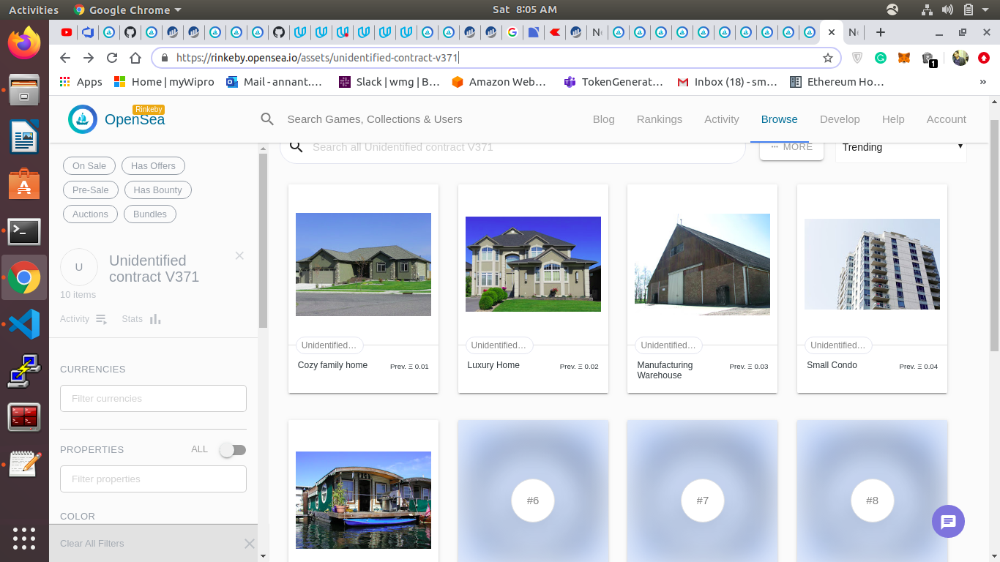

# Udacity Blockchain Capstone

The capstone will build upon the knowledge you have gained in the course in order to build a decentralized housing product. 

## Getting Started

### Prequisites
For development make sure ganache-cli is installed globally,metamask extension is enabled and solidity compiler is configured in truffle config.

### Install Dependencies
* Install all requisite npm packages
```
npm install
```


### ZoKrates Setup

 The following instructions explain how to generate addtional proofs for tokenIds.

* Step 1: Run Docker

* Step 2: Run ZoKrates
  ```
  docker run -v `pwd`/zokrates/code/:/home/zokrates/code -ti zokrates/zokrates /bin/bash
  ```

  Change into the square directory
  ``` 
  cd code/square/
  ``` 

* Step 3: Compile the program written in ZoKrates DSL
  ``` 
  ~/zokrates compile -i square.code
  ``` 

* Step 4: Generate the trusted setup
  ``` 
  ~/zokrates setup -s GM17
  ```

* Step 5: Compute witness
  ``` 
  ~/zokrates compute-witness -a 3 9
  ```

* Step 6: Generate proof
  ```
  ~/zokrates generate-proof -s GM17 -j <path to proof file>
  ```

* Step 7: Export verifier
  ```  
  ~/zokrates export-verifier -s GM17
  ```
Re-run steps 5 and 6 with different arguments, e.g. 2 4, to generate additional proofs for minting tokens.

### Development environment
* Run ganache:
```
ganache-cli
```
* In another terminal window:
```
cd eth-contracts
```
* Compile the contracts:
```
truffle compile
```

* This will create the smart contract artifacts in folder ```build/contracts```.

* Migrate smart contracts to the locally running blockchain, ganache-cli:

```
truffle migrate
```

* Test the smart contracts:

```
truffle test
```

### Deploy on Rinkeby
Run
```
truffle migrate --network rinkeby --reset --compile-all
```


#### Output
```
Starting migrations...
======================
> Network name:    'rinkeby'
> Network id:      4
> Block gas limit: 0x989680


1_initial_migration.js
======================

   Replacing 'Migrations'
   ----------------------
   > transaction hash:    0xf14778e6f1cc0155596957480880d923a6c4571c8bbc51e64914aa30bc32c99b
   > Blocks: 0            Seconds: 10
   > contract address:    0xf4b92f746123B8Fc9BB72c8a908DFd0F4419e526
   > block number:        6494878
   > block timestamp:     1589578610
   > account:             0x7554744F910b0E8925f108a40201eE25B4823ab1
   > balance:             3.698804211977956869
   > gas used:            225237
   > gas price:           10 gwei
   > value sent:          0 ETH
   > total cost:          0.00225237 ETH


   > Saving migration to chain.
   > Saving artifacts
   -------------------------------------
   > Total cost:          0.00225237 ETH


2_deploy_contracts.js
=====================

   Replacing 'RealStateToken'
   --------------------------
   > transaction hash:    0xbf939a84102fe463d0bbfa3501052267f68938c80a74e6f948200475f73bab5e
   > Blocks: 0            Seconds: 5
   > contract address:    0x959a9Bbd48a39A6031fCaaB4E3D38212c72173a8
   > block number:        6494880
   > block timestamp:     1589578640
   > account:             0x7554744F910b0E8925f108a40201eE25B4823ab1
   > balance:             3.670291491977956869
   > gas used:            2808909
   > gas price:           10 gwei
   > value sent:          0 ETH
   > total cost:          0.02808909 ETH


   Replacing 'BN256G2'
   -------------------
   > transaction hash:    0x1f6d08bca6bfaff0faec198420bae2dfd8cd9c10627703f8d5c899ba65cffea2
   > Blocks: 0            Seconds: 6
   > contract address:    0x984676E4c88A753d2c8226194A1250cff1500d7e
   > block number:        6494881
   > block timestamp:     1589578655
   > account:             0x7554744F910b0E8925f108a40201eE25B4823ab1
   > balance:             3.659955751977956869
   > gas used:            1033574
   > gas price:           10 gwei
   > value sent:          0 ETH
   > total cost:          0.01033574 ETH


   Linking
   -------
   * Contract: Verifier <--> Library: BN256G2 (at address: 0x984676E4c88A753d2c8226194A1250cff1500d7e)

   Replacing 'Verifier'
   --------------------
   > transaction hash:    0xcb11f63ea4fc63ba88dcd80aeadc37ee435aae508c64b6d97a482698f1ddc849
   > Blocks: 0            Seconds: 5
   > contract address:    0x78cdF558A7A22248c55741947D9C0afBb9e1826a
   > block number:        6494882
   > block timestamp:     1589578670
   > account:             0x7554744F910b0E8925f108a40201eE25B4823ab1
   > balance:             3.647938281977956869
   > gas used:            1201747
   > gas price:           10 gwei
   > value sent:          0 ETH
   > total cost:          0.01201747 ETH


   Replacing 'SolnSquareVerifier'
   ------------------------------
   > transaction hash:    0xc7709557b0ae019ec8f4d2f6cf2f50e97593be9fb9e5d0c50f85415229a4a83c
   > Blocks: 0            Seconds: 5
   > contract address:    0x401c7103567104A8a309f9C8B09B4B01165c44A9
   > block number:        6494883
   > block timestamp:     1589578685
   > account:             0x7554744F910b0E8925f108a40201eE25B4823ab1
   > balance:             3.614411271977956869
   > gas used:            3352701
   > gas price:           10 gwei
   > value sent:          0 ETH
   > total cost:          0.03352701 ETH


   > Saving migration to chain.
   > Saving artifacts
   -------------------------------------
   > Total cost:          0.08396931 ETH


Summary
=======
> Total deployments:   5
> Final cost:          0.08622168 ETH


```

### Mint Tokens
* Inside ```eth-contracts folder```, Run
```
node addSolution.js ../zokrates/code/square/proofs/proof<number>.json <tokenId>
```
	
	
## output for token 1
```
Submitting solution:
- Input: 0x0000000000000000000000000000000000000000000000000000000000000009,0x0000000000000000000000000000000000000000000000000000000000000001
- TokenID: 1
- Address: 0x7554744F910b0E8925f108a40201eE25B4823ab1
{ blockHash: '0x171540903afc24017cc93750d05dce8ac16ec4a93a2883f5a8b08b620f216961',
  blockNumber: 6494886,
  contractAddress: null,
  cumulativeGasUsed: 1330172,
  from: '0x7554744f910b0e8925f108a40201ee25b4823ab1',
  gasUsed: 487594,
  logsBloom: '0x00000000000000000000000040000008000000000000000400000800000000000800000200000000000002000000000000000000000112000000000004040000000000000000020000000000000000000000000000040000000000000000000000000000000000000000000000000000000000000000000000000000000000000000000000000000800000000000100000000000000000000000000000000000000000000000000000000000000000000000000000000000000000000000008000000000000000000000000000000800000000000000000000000000000040000000020000000000000000000000000000000000400000000000000000000000',
  status: true,
  to: '0x401c7103567104a8a309f9c8b09b4b01165c44a9',
  transactionHash: '0x2dd15934e4282a4cf110d0f6f19ecdbc7ee9a0490e7faacfe97047dfd2c1fcd7',
  transactionIndex: 7,
  events: 
   { '0': 
      { address: '0x78cdF558A7A22248c55741947D9C0afBb9e1826a',
        blockHash: '0x171540903afc24017cc93750d05dce8ac16ec4a93a2883f5a8b08b620f216961',
        blockNumber: 6494886,
        logIndex: 13,
        removed: false,
        transactionHash: '0x2dd15934e4282a4cf110d0f6f19ecdbc7ee9a0490e7faacfe97047dfd2c1fcd7',
        transactionIndex: 7,
        id: 'log_e1d69216',
        returnValues: Result {},
        event: undefined,
        signature: null,
        raw: [Object] },
     solutionAdded: 
      { address: '0x401c7103567104A8a309f9C8B09B4B01165c44A9',
        blockHash: '0x171540903afc24017cc93750d05dce8ac16ec4a93a2883f5a8b08b620f216961',
        blockNumber: 6494886,
        logIndex: 14,
        removed: false,
        transactionHash: '0x2dd15934e4282a4cf110d0f6f19ecdbc7ee9a0490e7faacfe97047dfd2c1fcd7',
        transactionIndex: 7,
        id: 'log_82648e56',
        returnValues: [Object],
        event: 'solutionAdded',
        signature: '0x009c6ded84843084fe9bc0caed609ea68a61107c44ae1f1ae757f07d382edde5',
        raw: [Object] } } }


```

```
node mintToken.js <tokenId>
```

#### Output for tokenid 1
```
Before minting, the contract has 0 token
Minting new token:
- Token ID: 1
- Address 0x7554744F910b0E8925f108a40201eE25B4823ab1
{ blockHash: '0x30eea897c1e7630f9ad594b8c2d5f4bb8d54e2605971503fe594913e9613c9cc',
  blockNumber: 6494888,
  contractAddress: null,
  cumulativeGasUsed: 896370,
  from: '0x7554744f910b0e8925f108a40201ee25b4823ab1',
  gasUsed: 242493,
  logsBloom: '0x00000000000000000000000000000000000000000000000000000800000000000000000000000000000000000000000000000000000100000000000000040000000000000000000000000008000000000000000000040000000000000000000000000000020000000000000000000800000000000000000000000010000000000000000000000000800000000000100000000000000000000000000000000000000000000000000000000000000000000000000000000000000000000000008000000002000000000000000000000800000000000000000000000000000060000000000000000000000000000000000000000000000000000000000000000000',
  status: true,
  to: '0x401c7103567104a8a309f9c8b09b4b01165c44a9',
  transactionHash: '0x7095287b3fef717c4965a86dc939bb471e8af84039df8b0f2f09bc6bbbecf34a',
  transactionIndex: 4,
  events: 
   { Transfer: 
      { address: '0x401c7103567104A8a309f9C8B09B4B01165c44A9',
        blockHash: '0x30eea897c1e7630f9ad594b8c2d5f4bb8d54e2605971503fe594913e9613c9cc',
        blockNumber: 6494888,
        logIndex: 18,
        removed: false,
        transactionHash: '0x7095287b3fef717c4965a86dc939bb471e8af84039df8b0f2f09bc6bbbecf34a',
        transactionIndex: 4,
        id: 'log_b0f78178',
        returnValues: [Object],
        event: 'Transfer',
        signature: '0xddf252ad1be2c89b69c2b068fc378daa952ba7f163c4a11628f55a4df523b3ef',
        raw: [Object] } } }
After minting, the contract has 1 token


```
Similarly the output will be for others token id 1-10


### Contract Address and ABI
## View the contracts on etherscan 
  *	"Verifier": "0x78cdF558A7A22248c55741947D9C0afBb9e1826a",
	*	"SolnSquareVerifier": "0x401c7103567104A8a309f9C8B09B4B01165c44A9"
#### Contract ABI
* Verifier
```
"abi": [
    {
      "anonymous": false,
      "inputs": [
        {
          "indexed": false,
          "internalType": "string",
          "name": "s",
          "type": "string"
        }
      ],
      "name": "Verified",
      "type": "event"
    },
    {
      "constant": false,
      "inputs": [
        {
          "internalType": "uint256[2]",
          "name": "a",
          "type": "uint256[2]"
        },
        {
          "internalType": "uint256[2][2]",
          "name": "b",
          "type": "uint256[2][2]"
        },
        {
          "internalType": "uint256[2]",
          "name": "c",
          "type": "uint256[2]"
        },
        {
          "internalType": "uint256[2]",
          "name": "input",
          "type": "uint256[2]"
        }
      ],
      "name": "verifyTx",
      "outputs": [
        {
          "internalType": "bool",
          "name": "r",
          "type": "bool"
        }
      ],
      "payable": false,
      "stateMutability": "nonpayable",
      "type": "function"
    }
  ],

```
* SolnSquareVerifier
```
"abi": [
    {
      "inputs": [
        {
          "internalType": "address",
          "name": "verifierAddress",
          "type": "address"
        }
      ],
      "payable": false,
      "stateMutability": "nonpayable",
      "type": "constructor"
    },
    {
      "anonymous": false,
      "inputs": [
        {
          "indexed": true,
          "internalType": "address",
          "name": "owner",
          "type": "address"
        },
        {
          "indexed": true,
          "internalType": "address",
          "name": "approved",
          "type": "address"
        },
        {
          "indexed": true,
          "internalType": "uint256",
          "name": "tokenId",
          "type": "uint256"
        }
      ],
      "name": "Approval",
      "type": "event"
    },
    {
      "anonymous": false,
      "inputs": [
        {
          "indexed": true,
          "internalType": "address",
          "name": "owner",
          "type": "address"
        },
        {
          "indexed": true,
          "internalType": "address",
          "name": "operator",
          "type": "address"
        },
        {
          "indexed": false,
          "internalType": "bool",
          "name": "approved",
          "type": "bool"
        }
      ],
      "name": "ApprovalForAll",
      "type": "event"
    },
    {
      "anonymous": false,
      "inputs": [
        {
          "indexed": true,
          "internalType": "address",
          "name": "Operator",
          "type": "address"
        }
      ],
      "name": "Paused",
      "type": "event"
    },
    {
      "anonymous": false,
      "inputs": [
        {
          "indexed": true,
          "internalType": "address",
          "name": "from",
          "type": "address"
        },
        {
          "indexed": true,
          "internalType": "address",
          "name": "to",
          "type": "address"
        },
        {
          "indexed": true,
          "internalType": "uint256",
          "name": "tokenId",
          "type": "uint256"
        }
      ],
      "name": "Transfer",
      "type": "event"
    },
    {
      "anonymous": false,
      "inputs": [
        {
          "indexed": true,
          "internalType": "address",
          "name": "Operator",
          "type": "address"
        }
      ],
      "name": "Unpaused",
      "type": "event"
    },
    {
      "anonymous": false,
      "inputs": [
        {
          "indexed": true,
          "internalType": "address",
          "name": "previousOwner",
          "type": "address"
        },
        {
          "indexed": true,
          "internalType": "address",
          "name": "newOwner",
          "type": "address"
        }
      ],
      "name": "ownerShipTransferred",
      "type": "event"
    },
    {
      "anonymous": false,
      "inputs": [
        {
          "indexed": true,
          "internalType": "uint256",
          "name": "tokenId",
          "type": "uint256"
        },
        {
          "indexed": true,
          "internalType": "bytes32",
          "name": "key",
          "type": "bytes32"
        },
        {
          "indexed": true,
          "internalType": "address",
          "name": "to",
          "type": "address"
        }
      ],
      "name": "solutionAdded",
      "type": "event"
    },
    {
      "constant": false,
      "inputs": [
        {
          "internalType": "bool",
          "name": "pause",
          "type": "bool"
        }
      ],
      "name": "Pause",
      "outputs": [],
      "payable": false,
      "stateMutability": "nonpayable",
      "type": "function"
    },
    {
      "constant": false,
      "inputs": [
        {
          "internalType": "bool",
          "name": "pause",
          "type": "bool"
        }
      ],
      "name": "Unpause",
      "outputs": [],
      "payable": false,
      "stateMutability": "nonpayable",
      "type": "function"
    },
    {
      "constant": false,
      "inputs": [
        {
          "internalType": "bytes32",
          "name": "_myid",
          "type": "bytes32"
        },
        {
          "internalType": "string",
          "name": "_result",
          "type": "string"
        }
      ],
      "name": "__callback",
      "outputs": [],
      "payable": false,
      "stateMutability": "nonpayable",
      "type": "function"
    },
    {
      "constant": false,
      "inputs": [
        {
          "internalType": "bytes32",
          "name": "_myid",
          "type": "bytes32"
        },
        {
          "internalType": "string",
          "name": "_result",
          "type": "string"
        },
        {
          "internalType": "bytes",
          "name": "_proof",
          "type": "bytes"
        }
      ],
      "name": "__callback",
      "outputs": [],
      "payable": false,
      "stateMutability": "nonpayable",
      "type": "function"
    },
    {
      "constant": false,
      "inputs": [
        {
          "internalType": "address",
          "name": "to",
          "type": "address"
        },
        {
          "internalType": "uint256",
          "name": "tokenId",
          "type": "uint256"
        }
      ],
      "name": "approve",
      "outputs": [],
      "payable": false,
      "stateMutability": "nonpayable",
      "type": "function"
    },
    {
      "constant": true,
      "inputs": [
        {
          "internalType": "address",
          "name": "owner",
          "type": "address"
        }
      ],
      "name": "balanceOf",
      "outputs": [
        {
          "internalType": "uint256",
          "name": "",
          "type": "uint256"
        }
      ],
      "payable": false,
      "stateMutability": "view",
      "type": "function"
    },
    {
      "constant": true,
      "inputs": [
        {
          "internalType": "uint256",
          "name": "tokenId",
          "type": "uint256"
        }
      ],
      "name": "getApproved",
      "outputs": [
        {
          "internalType": "address",
          "name": "",
          "type": "address"
        }
      ],
      "payable": false,
      "stateMutability": "view",
      "type": "function"
    },
    {
      "constant": true,
      "inputs": [],
      "name": "getBaseTokenURI",
      "outputs": [
        {
          "internalType": "string",
          "name": "",
          "type": "string"
        }
      ],
      "payable": false,
      "stateMutability": "view",
      "type": "function"
    },
    {
      "constant": true,
      "inputs": [],
      "name": "getContractOwner",
      "outputs": [
        {
          "internalType": "address",
          "name": "",
          "type": "address"
        }
      ],
      "payable": false,
      "stateMutability": "view",
      "type": "function"
    },
    {
      "constant": true,
      "inputs": [],
      "name": "getTokenName",
      "outputs": [
        {
          "internalType": "string",
          "name": "",
          "type": "string"
        }
      ],
      "payable": false,
      "stateMutability": "view",
      "type": "function"
    },
    {
      "constant": true,
      "inputs": [],
      "name": "getTokenSymbol",
      "outputs": [
        {
          "internalType": "string",
          "name": "",
          "type": "string"
        }
      ],
      "payable": false,
      "stateMutability": "view",
      "type": "function"
    },
    {
      "constant": true,
      "inputs": [
        {
          "internalType": "address",
          "name": "owner",
          "type": "address"
        },
        {
          "internalType": "address",
          "name": "operator",
          "type": "address"
        }
      ],
      "name": "isApprovedForAll",
      "outputs": [
        {
          "internalType": "bool",
          "name": "",
          "type": "bool"
        }
      ],
      "payable": false,
      "stateMutability": "view",
      "type": "function"
    },
    {
      "constant": false,
      "inputs": [
        {
          "internalType": "address",
          "name": "to",
          "type": "address"
        },
        {
          "internalType": "uint256",
          "name": "tokenId",
          "type": "uint256"
        }
      ],
      "name": "mint",
      "outputs": [
        {
          "internalType": "bool",
          "name": "",
          "type": "bool"
        }
      ],
      "payable": false,
      "stateMutability": "nonpayable",
      "type": "function"
    },
    {
      "constant": true,
      "inputs": [
        {
          "internalType": "uint256",
          "name": "tokenId",
          "type": "uint256"
        }
      ],
      "name": "ownerOf",
      "outputs": [
        {
          "internalType": "address",
          "name": "",
          "type": "address"
        }
      ],
      "payable": false,
      "stateMutability": "view",
      "type": "function"
    },
    {
      "constant": false,
      "inputs": [
        {
          "internalType": "address",
          "name": "from",
          "type": "address"
        },
        {
          "internalType": "address",
          "name": "to",
          "type": "address"
        },
        {
          "internalType": "uint256",
          "name": "tokenId",
          "type": "uint256"
        }
      ],
      "name": "safeTransferFrom",
      "outputs": [],
      "payable": false,
      "stateMutability": "nonpayable",
      "type": "function"
    },
    {
      "constant": false,
      "inputs": [
        {
          "internalType": "address",
          "name": "from",
          "type": "address"
        },
        {
          "internalType": "address",
          "name": "to",
          "type": "address"
        },
        {
          "internalType": "uint256",
          "name": "tokenId",
          "type": "uint256"
        },
        {
          "internalType": "bytes",
          "name": "_data",
          "type": "bytes"
        }
      ],
      "name": "safeTransferFrom",
      "outputs": [],
      "payable": false,
      "stateMutability": "nonpayable",
      "type": "function"
    },
    {
      "constant": false,
      "inputs": [
        {
          "internalType": "address",
          "name": "to",
          "type": "address"
        },
        {
          "internalType": "bool",
          "name": "approved",
          "type": "bool"
        }
      ],
      "name": "setApprovalForAll",
      "outputs": [],
      "payable": false,
      "stateMutability": "nonpayable",
      "type": "function"
    },
    {
      "constant": true,
      "inputs": [
        {
          "internalType": "bytes4",
          "name": "interfaceId",
          "type": "bytes4"
        }
      ],
      "name": "supportsInterface",
      "outputs": [
        {
          "internalType": "bool",
          "name": "",
          "type": "bool"
        }
      ],
      "payable": false,
      "stateMutability": "view",
      "type": "function"
    },
    {
      "constant": true,
      "inputs": [
        {
          "internalType": "uint256",
          "name": "index",
          "type": "uint256"
        }
      ],
      "name": "tokenByIndex",
      "outputs": [
        {
          "internalType": "uint256",
          "name": "",
          "type": "uint256"
        }
      ],
      "payable": false,
      "stateMutability": "view",
      "type": "function"
    },
    {
      "constant": true,
      "inputs": [
        {
          "internalType": "address",
          "name": "owner",
          "type": "address"
        },
        {
          "internalType": "uint256",
          "name": "index",
          "type": "uint256"
        }
      ],
      "name": "tokenOfOwnerByIndex",
      "outputs": [
        {
          "internalType": "uint256",
          "name": "",
          "type": "uint256"
        }
      ],
      "payable": false,
      "stateMutability": "view",
      "type": "function"
    },
    {
      "constant": true,
      "inputs": [
        {
          "internalType": "uint256",
          "name": "tokenId",
          "type": "uint256"
        }
      ],
      "name": "tokenURI",
      "outputs": [
        {
          "internalType": "string",
          "name": "",
          "type": "string"
        }
      ],
      "payable": false,
      "stateMutability": "view",
      "type": "function"
    },
    {
      "constant": true,
      "inputs": [],
      "name": "totalSupply",
      "outputs": [
        {
          "internalType": "uint256",
          "name": "",
          "type": "uint256"
        }
      ],
      "payable": false,
      "stateMutability": "view",
      "type": "function"
    },
    {
      "constant": false,
      "inputs": [
        {
          "internalType": "address",
          "name": "from",
          "type": "address"
        },
        {
          "internalType": "address",
          "name": "to",
          "type": "address"
        },
        {
          "internalType": "uint256",
          "name": "tokenId",
          "type": "uint256"
        }
      ],
      "name": "transferFrom",
      "outputs": [],
      "payable": false,
      "stateMutability": "nonpayable",
      "type": "function"
    },
    {
      "constant": false,
      "inputs": [
        {
          "internalType": "address",
          "name": "newOwner",
          "type": "address"
        }
      ],
      "name": "transferOwnership",
      "outputs": [],
      "payable": false,
      "stateMutability": "nonpayable",
      "type": "function"
    },
    {
      "constant": false,
      "inputs": [
        {
          "internalType": "uint256[2]",
          "name": "a",
          "type": "uint256[2]"
        },
        {
          "internalType": "uint256[2][2]",
          "name": "b",
          "type": "uint256[2][2]"
        },
        {
          "internalType": "uint256[2]",
          "name": "c",
          "type": "uint256[2]"
        },
        {
          "internalType": "uint256[2]",
          "name": "input",
          "type": "uint256[2]"
        },
        {
          "internalType": "address",
          "name": "to",
          "type": "address"
        },
        {
          "internalType": "uint256",
          "name": "tokenId",
          "type": "uint256"
        }
      ],
      "name": "addSolution",
      "outputs": [],
      "payable": false,
      "stateMutability": "nonpayable",
      "type": "function"
    },
    {
      "constant": false,
      "inputs": [
        {
          "internalType": "address",
          "name": "to",
          "type": "address"
        },
        {
          "internalType": "uint256",
          "name": "tokenId",
          "type": "uint256"
        }
      ],
      "name": "mintNFT",
      "outputs": [
        {
          "internalType": "bool",
          "name": "",
          "type": "bool"
        }
      ],
      "payable": false,
      "stateMutability": "nonpayable",
      "type": "function"
    }
  ],
```


* OpenSea Market Place - https://rinkeby.opensea.io/assets/unidentified-contract-v371

##5 Token bought by account 0xC2c1E51365ca5b473B32CF9E39ce19C9Ee2F37a0

#List of all token minted-
* https://rinkeby.opensea.io/assets/0x401c7103567104a8a309f9c8b09b4b01165c44a9/1
* https://rinkeby.opensea.io/assets/0x401c7103567104a8a309f9c8b09b4b01165c44a9/2
* https://rinkeby.opensea.io/assets/0x401c7103567104a8a309f9c8b09b4b01165c44a9/3
* https://rinkeby.opensea.io/assets/0x401c7103567104a8a309f9c8b09b4b01165c44a9/4
* https://rinkeby.opensea.io/assets/0x401c7103567104a8a309f9c8b09b4b01165c44a9/5
* https://rinkeby.opensea.io/assets/0x401c7103567104a8a309f9c8b09b4b01165c44a9/6
* https://rinkeby.opensea.io/assets/0x401c7103567104a8a309f9c8b09b4b01165c44a9/7
* https://rinkeby.opensea.io/assets/0x401c7103567104a8a309f9c8b09b4b01165c44a9/8
* https://rinkeby.opensea.io/assets/0x401c7103567104a8a309f9c8b09b4b01165c44a9/9
* https://rinkeby.opensea.io/assets/0x401c7103567104a8a309f9c8b09b4b01165c44a9/10

# List of token sold to other account- 0xC2c1E51365ca5b473B32CF9E39ce19C9Ee2F37a0
* https://rinkeby.opensea.io/assets/0x401c7103567104a8a309f9c8b09b4b01165c44a9/1
* https://rinkeby.opensea.io/assets/0x401c7103567104a8a309f9c8b09b4b01165c44a9/2
* https://rinkeby.opensea.io/assets/0x401c7103567104a8a309f9c8b09b4b01165c44a9/3
* https://rinkeby.opensea.io/assets/0x401c7103567104a8a309f9c8b09b4b01165c44a9/4
* https://rinkeby.opensea.io/assets/0x401c7103567104a8a309f9c8b09b4b01165c44a9/5




# Project Resources

* [Remix - Solidity IDE](https://remix.ethereum.org/)
* [Visual Studio Code](https://code.visualstudio.com/)
* [Truffle Framework](https://truffleframework.com/)
* [Ganache - One Click Blockchain](https://truffleframework.com/ganache)
* [Open Zeppelin ](https://openzeppelin.org/)
* [Interactive zero knowledge 3-colorability demonstration](http://web.mit.edu/~ezyang/Public/graph/svg.html)
* [Docker](https://docs.docker.com/install/)
* [ZoKrates](https://github.com/Zokrates/ZoKrates)
